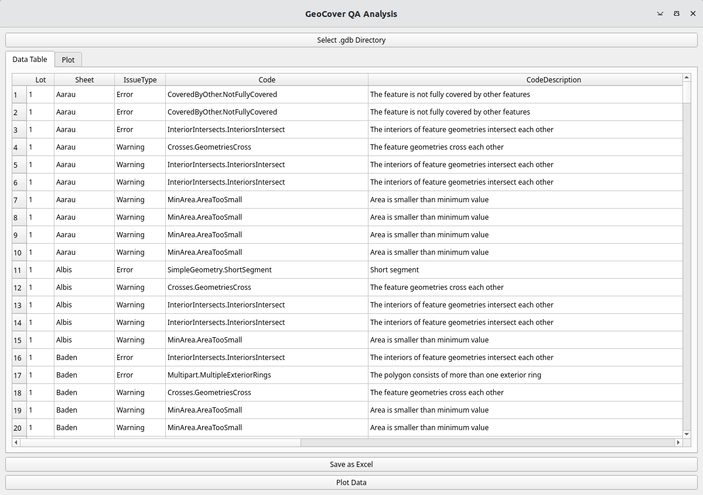

# lg-geocover-qa-report

Simple python library and tools to generate reports from quality test results for the dataset [GeoCover](https://www.swisstopo.admin.ch/en/geological-model-2d-geocover)

## Installation

For the library:

    conda install swisstopo:geocover-qa

or

    pip install geocover-qa

## Usage
